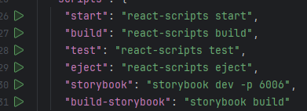

# Registration App

This project is a simple registration application built with React and TypeScript. It includes form validation, internationalization, and UI components using Material UI.

## Installation

Clone the repository. After cloning go to the root directory and install dependencies via:

```sh
npm install
```

## Running the Project

To start the development server:

```sh
npm start
```

If you are using a JetBrains IDE (Webstorm or intelliJ), you can also install the dependencies via the IDE's built-in terminal.


## Dependencies

- **React 18** - Core library for building the UI
- **Material UI** - UI components for styling
- **Formik & Yup** - Form handling and validation
- **React Router** - Client-side routing
- **Axios** - HTTP requests
- **i18next & react-i18next** - Internationalization support

## Building for Production

To create a production build:

```sh
npm run build
```
